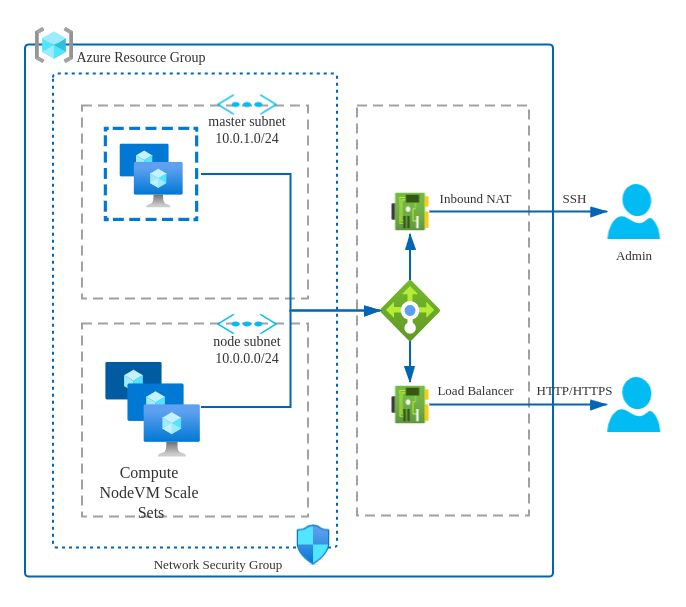

# Kubernetes cluster with Availability Sets Master and VMSS Cluster Node 

This template allows you to deploy Kubernetes cluster infrastructrues.

## Architecture

## deploy

 

### Use az command
az group deployment create --resource-group KubeSphereVMRG --template-file ./azuredeploy.json --parameters @azuredeploy.parameters.json

